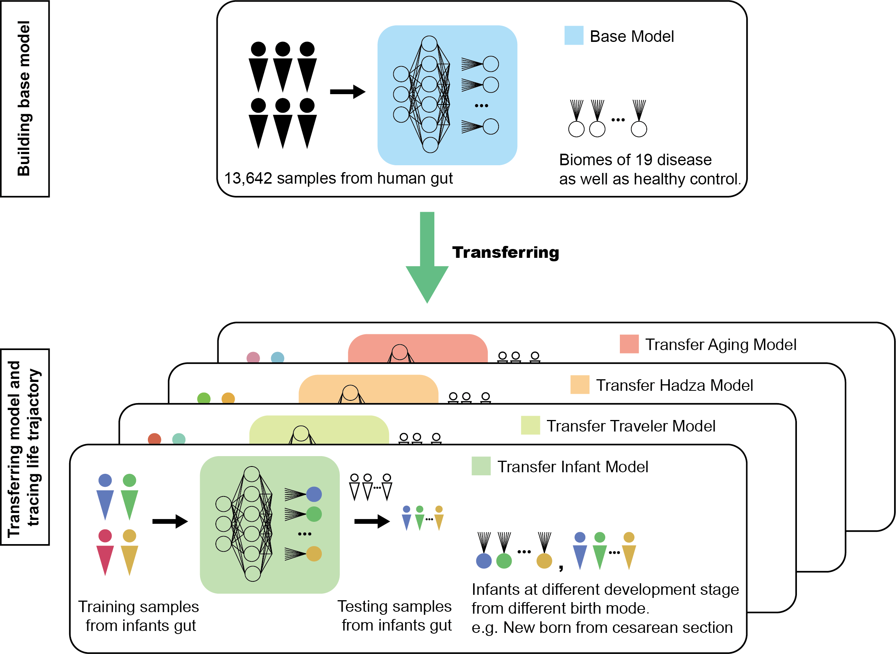

# EXPERT-longitudinal
Human gut microbiome is highly dynamic along the life span. Though human gut microbial community patterns could partly represent the stage-specific or status-specific phenotype of the hosts, the underlying association between gut microbial communities and time-related factors remains unclear, making life trajectory of host based on gut microbial communities difficult. 

In this study, we used EXPERT-longitudinal, a deep learning method based on neural network and transfer learning, for tracking the longitudinal microbial community alterations in diverse contexts. We demonstrated the use of EXPERT-longitudinal to accurate modeling for dynamic patterns of human gut microbial communities at several life stages, including infancy, middle age and the elderly. In these critical life stages, we unveiled the influence of delivery mode on microbial communities of infant gut, the association between microbial communities of middle age and long-term dietary shifts, and the potential correlation between longevity and gut microbiome of the elderly. 
## Pipeline
